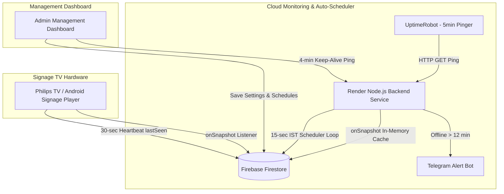

# Bhimavaram Digitals Signage Dashboard & Cloud Auto-Scheduler

Web-based admin management console and 24/7 cloud auto-scheduler for **Bhimavaram Digitals's Digital Signage Network**.

Allows operators to pair TV screens, build ad playlists, set up multi-slot time schedules, monitor online/offline status, view real-time WebRTC live video feeds, and aggregate playback analytics — all backed by Firebase Firestore in real time with zero page refreshes.

---

## 📑 Table of Contents

1. [System Architecture](#system-architecture)
2. [Free Tier Cost Analysis ($0/month)](#free-tier-cost-analysis-0month)
3. [Complete File-by-File Directory Breakdown](#complete-file-by-file-directory-breakdown)
   * [Root Directory](#1-root-directory-)
   * [Backend Directory (`/backend`)](#2-backend-directory-backend)
   * [Dashboard Directory (`/dashboard`)](#3-dashboard-directory-dashboard)
   * [Dashboard Modules Directory (`/dashboard/modules`)](#4-dashboard-modules-directory-dashboardmodules)
4. [Auto-Scheduler & Heartbeat Deep-Dive](#auto-scheduler--heartbeat-deep-dive)
5. [System Limitations & Guardrails](#system-limitations--guardrails)
6. [Setup & Deployment Guide](#setup--deployment-guide)
7. [License](#license)

---

## System Architecture

---

## Free Tier Cost Analysis ($0/month)

> [!NOTE]
> **Total Monthly Cost: $0.00 / ₹0.00 (100% FREE)**  
> Every component of this project operates strictly within permanent free tier allowances.

| Component | Service Provider | Free Tier Allowance | Project Usage | Monthly Cost |
| :--- | :--- | :--- | :--- | :--- |
| **Backend Service** | [Render.com](https://render.com) | **750 free instance hours** / month | **744 hours** / month (31 days × 24h) | **$0.00** |
| **Cloud Database** | [Google Firestore](https://firebase.google.com) | **50,000 reads** & **20,000 writes** / day | **< 50 reads** & **< 100 writes** / day | **$0.00** |
| **24/7 Keep-Alive** | [UptimeRobot](https://uptimerobot.com) | **50 HTTP monitors** @ 5-min intervals | **1 monitor** @ 5-min intervals | **$0.00** |
| **Asset Storage** | [Cloudflare R2](https://cloudflare.com) | **10 GB storage** & 10M reads / month | **< 2 GB storage** | **$0.00** |
| **Edge API Worker** | Cloudflare Workers | **100,000 requests** / day | **< 500 requests** / day | **$0.00** |

### Why Render is 100% Free
* 1 month = 31 days × 24 hours = **744 hours**.
* Render provides **750 free hours** per account. Running **1 single web service 24/7** uses 744 hours, leaving 6 spare hours every month.

### Why Firestore is 100% Free
* **In-Memory Caching (`onSnapshot`)**: The backend opens a single real-time stream upon boot. The 15-second background check loop evaluates memory variables in Node.js RAM, incurring **0 database reads**.
* **Guarded Writes**: Firestore writes only execute when a playlist actually changes (`activeSlot.playlistId !== s.currentPlaylist`).

---

## Complete File-by-File Directory Breakdown

### 1. Root Directory (`/`)

* **[README.md](file:///c:/Users/harsh/OneDrive/Desktop/bhimavaram%20digitals/README.md)**: Master project documentation, technical architecture, file inventory, free tier analysis, limitations, and setup instructions.
* **[.gitignore](file:///c:/Users/harsh/OneDrive/Desktop/bhimavaram%20digitals/.gitignore)**: Configures Git to ignore `node_modules/`, environment files (`.env`), service account credentials, and IDE cache folders.
* **[.gitattributes](file:///c:/Users/harsh/OneDrive/Desktop/bhimavaram%20digitals/.gitattributes)**: Enforces consistent LF/CRLF line endings across Windows and Linux environments.

---

### 2. Backend Directory (`/backend`)

* **[backend/index.js](file:///c:/Users/harsh/OneDrive/Desktop/bhimavaram%20digitals/backend/index.js)**:
  * **Core Node.js backend application**.
  * **In-Memory Cache**: Uses Firestore `onSnapshot` to keep an in-memory mirror of the `screens` collection (0 read cost).
  * **15-Second Scheduler Loop**: Evaluates Indian Standard Time (IST: UTC+5:30) 24/7 schedules every 15 seconds and auto-pushes active playlists to screens.
  * **Offline Alerts**: Monitors screen heartbeats (`lastSeen`); if a device is silent for **> 12 minutes**, triggers a Telegram alert message via bot API.
  * **HTTP Keep-Alive Server**: Runs a lightweight HTTP web server on `process.env.PORT` (returns HTTP 200) required for Render free tier hosting.
* **[backend/package.json](file:///c:/Users/harsh/OneDrive/Desktop/bhimavaram%20digitals/backend/package.json)**: Node.js package manifest defining dependencies (`firebase-admin`).
* **[backend/package-lock.json](file:///c:/Users/harsh/OneDrive/Desktop/bhimavaram%20digitals/backend/package-lock.json)**: Lockfile locking exact versions of Node.js dependencies.
* **[backend/.env](file:///c:/Users/harsh/OneDrive/Desktop/bhimavaram%20digitals/backend/.env)**: Environment configuration file for Telegram Bot credentials (`TELEGRAM_BOT_TOKEN`, `TELEGRAM_CHAT_ID`) and Base64-encoded Firebase Service Account key.
* **[backend/my-signage-app-*.json](file:///c:/Users/harsh/OneDrive/Desktop/bhimavaram%20digitals/backend/my-signage-app-d0b8a-firebase-adminsdk-fbsvc-af88869b6f.json)**: Local development Firebase Admin SDK service account key.

---

### 3. Dashboard Directory (`/dashboard`)

* **[dashboard/index.html](file:///c:/Users/harsh/OneDrive/Desktop/bhimavaram%20digitals/dashboard/index.html)**:
  * **Main HTML document** for the management console.
  * Contains sidebar navigation, interactive stat summary cards, tab views (`screensView`, `playlistsView`, `groupsView`, `schedulerView`, `liveView`, `liveWallView`, `analyticsView`), mass launch modals, and preview dialogs.
* **[dashboard/app.js](file:///c:/Users/harsh/OneDrive/Desktop/bhimavaram%20digitals/dashboard/app.js)**:
  * **Main application bootstrap script**.
  * Initializes Firebase SDK, instantiates UI modules, binds global inline event handlers to window object, manages tab switching unmount/remount hooks, and executes the 4-minute Render backend keep-alive ping loop (`startBackendKeepAlive`).
* **[dashboard/config.js](file:///c:/Users/harsh/OneDrive/Desktop/bhimavaram%20digitals/dashboard/config.js)**:
  * **Production configuration file**.
  * Contains Firebase SDK keys, Supabase credentials, Cloudflare R2 worker endpoint (`r2WorkerUrl`), TURN worker endpoint (`turnWorkerUrl`), and Render Backend URL (`backendUrl: "https://digitals-signage.onrender.com"`).
* **[dashboard/config.example.js](file:///c:/Users/harsh/OneDrive/Desktop/bhimavaram%20digitals/dashboard/config.example.js)**: Config template file for new developers.
* **[dashboard/style.css](file:///c:/Users/harsh/OneDrive/Desktop/bhimavaram%20digitals/dashboard/style.css)**: Custom CSS stylesheet providing glassmorphism cards, dark sidebar layout, pulse status indicators, schedule lock badges, SVG color matrices, and responsive tables.
* **[dashboard/sw.js](file:///c:/Users/harsh/OneDrive/Desktop/bhimavaram%20digitals/dashboard/sw.js)**: Service worker for static file caching and offline dashboard accessibility.
* **[dashboard/_redirects](file:///c:/Users/harsh/OneDrive/Desktop/bhimavaram%20digitals/dashboard/_redirects)** & **[dashboard/netlify.toml](file:///c:/Users/harsh/OneDrive/Desktop/bhimavaram%20digitals/dashboard/netlify.toml)**: Hosting redirect rules for Netlify deployment.
* **[dashboard/logo.png](file:///c:/Users/harsh/OneDrive/Desktop/bhimavaram%20digitals/dashboard/logo.png)**: Brand logo image.

---

### 4. Dashboard Modules Directory (`/dashboard/modules`)

* **[dashboard/modules/screens.js](file:///c:/Users/harsh/OneDrive/Desktop/bhimavaram%20digitals/dashboard/modules/screens.js)**:
  * Manages screen pairing (6-digit pairing code validation), status filters (all/online/offline/expired), single/split screen layouts, rotation angles (0°–270°), bottom web ticker URLs, mass launch modals, and rendering the main screens table.
* **[dashboard/modules/scheduler.js](file:///c:/Users/harsh/OneDrive/Desktop/bhimavaram%20digitals/dashboard/modules/scheduler.js)**:
  * Handles 24/7 multi-slot scheduling per screen.
  * Normalizes time formats (`normalizeHhmmTime`), evaluates active slots (`getActiveSchedulerSlot`), renders live status chips (`🟢 Now playing...`), tracks unsaved changes, and executes a 30-second live fallback auto-push to Firestore.
* **[dashboard/modules/playlists.js](file:///c:/Users/harsh/OneDrive/Desktop/bhimavaram%20digitals/dashboard/modules/playlists.js)**:
  * Manages ad playlist creation and editing. Supports adding video/image/web items, setting duration seconds, resizing modes, rotation angles, previewing items, and saving to Firestore `playlists` collection.
* **[dashboard/modules/groups.js](file:///c:/Users/harsh/OneDrive/Desktop/bhimavaram%20digitals/dashboard/modules/groups.js)**:
  * Handles screen group creation, bulk settings deployment across screen clusters, timer schedule overrides, and group member selection.
* **[dashboard/modules/liveview.js](file:///c:/Users/harsh/OneDrive/Desktop/bhimavaram%20digitals/dashboard/modules/liveview.js)**:
  * Enables real-time WebRTC camera/screen live streaming for individual TV boxes. Handles STUN/TURN negotiation, ICE candidate setup, and SVG `feColorMatrix` transformation for BGR-to-RGB video channel correction.
* **[dashboard/modules/livewall.js](file:///c:/Users/harsh/OneDrive/Desktop/bhimavaram%20digitals/dashboard/modules/livewall.js)**:
  * Multi-screen video wall view rendering simultaneous WebRTC video streams across all online screens in a grid format.
* **[dashboard/modules/r2upload.js](file:///c:/Users/harsh/OneDrive/Desktop/bhimavaram%20digitals/dashboard/modules/r2upload.js)**:
  * Direct uploader for Cloudflare R2 object storage. Uploads video/image media via Cloudflare Worker proxy and returns public URLs.
* **[dashboard/modules/preview.js](file:///c:/Users/harsh/OneDrive/Desktop/bhimavaram%20digitals/dashboard/modules/preview.js)**:
  * Simulated screen player modal that renders real-time playlist playback (images, videos, web tickers) directly inside the browser.
* **[dashboard/modules/analytics.js](file:///c:/Users/harsh/OneDrive/Desktop/bhimavaram%20digitals/dashboard/modules/analytics.js)**:
  * Queries Firestore `analytics` collection group to aggregate play counts, total play duration (seconds), screen-by-screen breakdown, and date filtering graphs.
* **[dashboard/modules/auth.js](file:///c:/Users/harsh/OneDrive/Desktop/bhimavaram%20digitals/dashboard/modules/auth.js)**:
  * Admin login/logout authentication manager backed by Firebase Auth.
* **[dashboard/modules/firebase.js](file:///c:/Users/harsh/OneDrive/Desktop/bhimavaram%20digitals/dashboard/modules/firebase.js)**:
  * Initializes Firebase App compat SDK and exports database reference `db`.
* **[dashboard/modules/ui.js](file:///c:/Users/harsh/OneDrive/Desktop/bhimavaram%20digitals/dashboard/modules/ui.js)**:
  * Toast notification utility (`AppModules.showToast`) for success, warning, error alerts, and permission failure notifications.
* **[dashboard/modules/state.js](file:///c:/Users/harsh/OneDrive/Desktop/bhimavaram%20digitals/dashboard/modules/state.js)**:
  * Global reactive state manager (`appState`) caching screens, playlists, groups, and unsaved form edits.

---

## Auto-Scheduler & Heartbeat Deep-Dive

* **Heartbeat**: Sent by screen players every **30 seconds** to update `lastSeen` in Firestore. Heartbeats indicate device online/offline status and are independent of schedule pushing.
* **Schedule Push**: Handled by the backend loop every **15 seconds** (and dashboard fallback every 30 seconds). When a time slot begins, `currentPlaylist` in Firestore is updated immediately. TV screens receive the change in real-time via `onSnapshot` listeners.

---

## System Limitations & Guardrails

1. **Auto-Scheduler Lock**: When Auto-Scheduler is enabled on a screen (`schedulerEnabled: true`), manual playlist selection on the Screens tab is locked (`🔒 Scheduler ON`) to prevent accidental manual overrides.
2. **Render 1-Service Limit**: Ensure only **1 Web Service** is deployed on your free Render account so it stays within the 750 free hours/month limit.
3. **Timezone Standardization**: All cloud schedules are calculated in **IST (UTC+5:30)**. Internal hardware clock settings on TV devices do not affect schedule timing.

---

## Setup & Deployment Guide

1. **Configure Backend**:
   * Deploy `backend/` to [Render.com](https://render.com) as a Web Service.
   * Add environment variables: `FIREBASE_SERVICE_ACCOUNT_BASE64`, `TELEGRAM_BOT_TOKEN`, `TELEGRAM_CHAT_ID`.
2. **Configure Dashboard**:
   * Open `dashboard/config.js` and set `backendUrl: "https://YOUR-APP.onrender.com"`.
   * Deploy `dashboard/` to Netlify, Vercel, or GitHub Pages.
3. **Set Up 24/7 Keep-Alive**:
   * Create a free HTTP monitor on [UptimeRobot.com](https://uptimerobot.com) targeting `https://YOUR-APP.onrender.com` at 5-minute intervals.

---

## License

© 2026 Harsha Vardhan Eudu. All Rights Reserved. Proprietary software for Bhimavaram Digitals.
